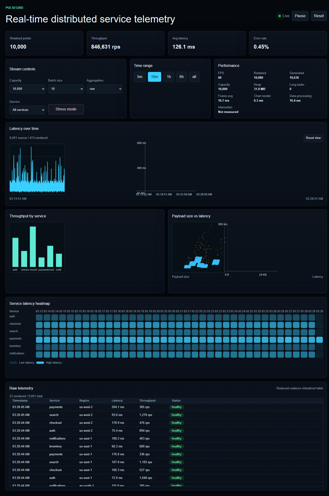
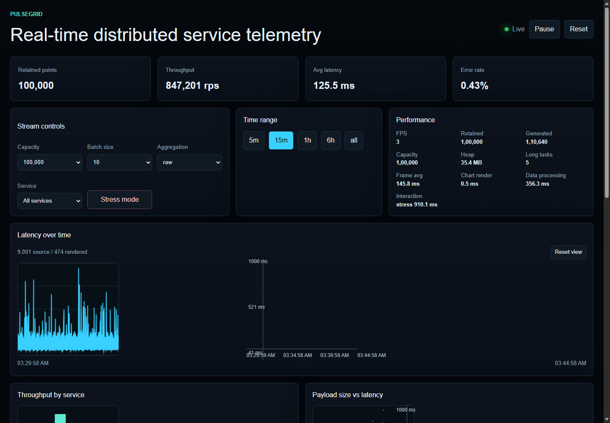
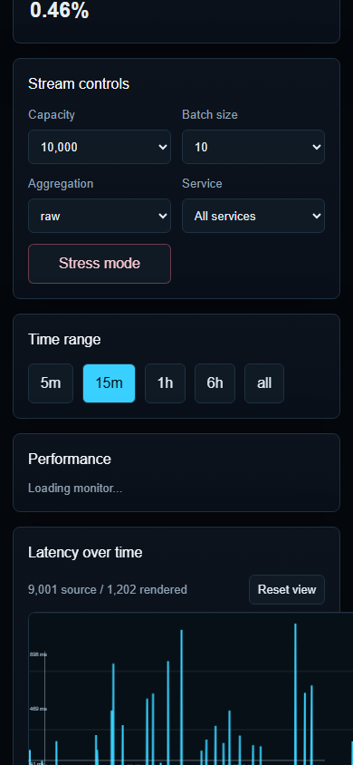
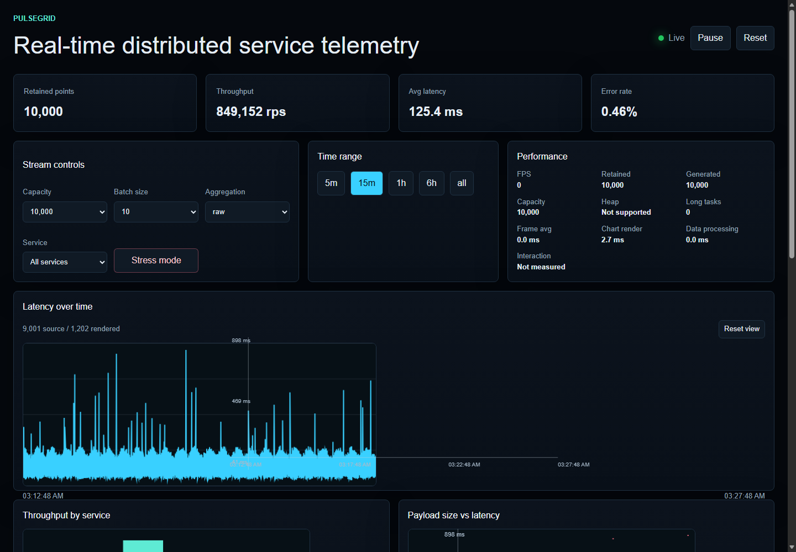
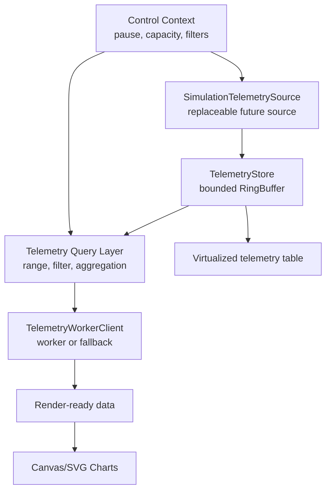
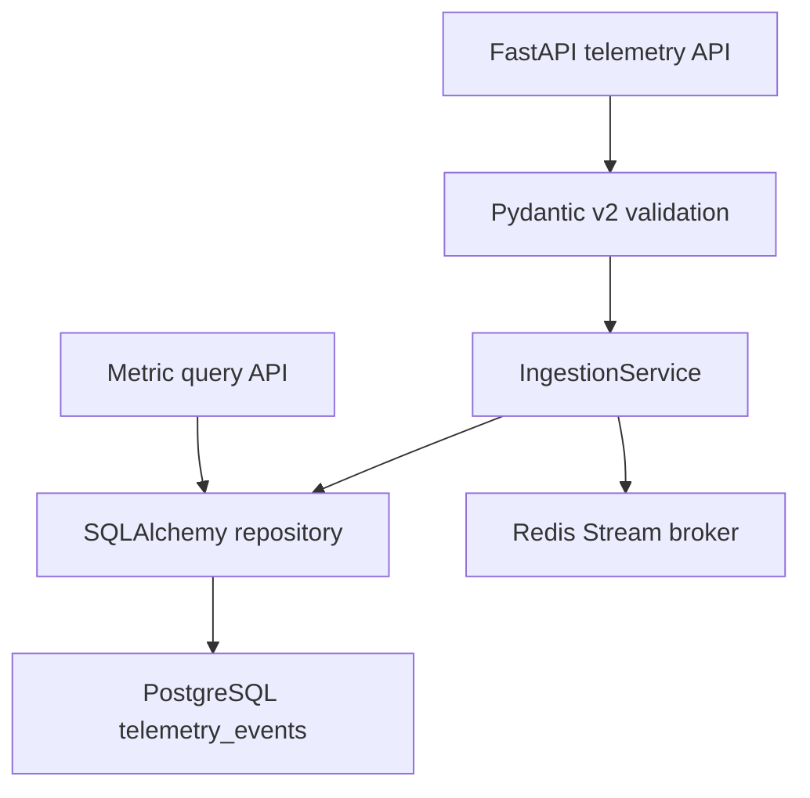

# Observa

High-performance real-time telemetry dashboard built with Next.js App Router, TypeScript, custom Canvas rendering, SVG overlays, custom table virtualization, bounded in-memory storage, and worker-backed processing.

[Live Demo](https://performance-dashboard-rose.vercel.app/dashboard)  
[GitHub Repository](https://github.com/ayushxt25/Performance-Dashboard)

`Next.js 16` `React 19` `TypeScript` `Canvas` `SVG overlays` `Web Worker` `Vitest`

The original v1.0.0 recruitment build is preserved; the current architecture prepares the same simulated dashboard for a future replaceable telemetry backend.
Phase 3 adds an optional remote backend mode while preserving simulation mode.

## Project Preview



Dashboard overview captured from the deployed application. It shows the live telemetry header, KPI cards, stream controls, performance monitor, Canvas charts, heatmap, and virtualized table.



Stress-test mode using the real UI and live measured values. The screenshot is not edited and does not fabricate performance numbers.



Mobile viewport showing the responsive control panel and chart layout.



Raw telemetry table with custom virtual scrolling and rendered-row count.

## Overview

PulseGrid is a dark observability-style dashboard for monitoring simulated distributed application services. It generates telemetry for service latency, throughput, CPU usage, memory usage, error rate, payload size, region, and status.

The project is intentionally performance-focused. It retains large datasets in bounded memory, ingests new telemetry every 100ms, avoids external chart libraries, and renders dense chart marks manually with Canvas. Lightweight SVG and HTML layers handle axes, labels, descriptions, controls, and interaction affordances where DOM-based rendering is more appropriate.

PulseGrid was built as a recruitment assignment to demonstrate practical frontend architecture: Server Components for initial data, Client Components for interaction, careful React state boundaries, custom chart rendering, Web Worker processing, and production-build validation.

## Key Features

- Real-time simulated telemetry updates every 100ms.
- Typed telemetry model with services, regions, statuses, latency, throughput, CPU, memory, error rate, and payload size.
- Capacity presets for 10,000, 50,000, and 100,000 retained points.
- Fixed-capacity circular buffer to prevent unbounded memory growth.
- Pause, resume, reset, batch-size controls, and stress-test mode.
- Service filtering and time-range selection.
- Raw, 1-minute, 5-minute, and 1-hour aggregation modes.
- Canvas line chart for latency over time with zoom, pan, reset view, hover tooltip, and viewport-aware downsampling.
- Canvas bar chart for throughput by service.
- Canvas scatter plot for payload size versus latency.
- Service latency heatmap.
- SVG overlays for semantic chart structure, axis lines, tick labels, and the latency crosshair.
- Custom virtualized telemetry table without an external virtualization library.
- Visible performance monitor for FPS, frame duration, chart render duration, data-processing duration, interaction latency, retained/generated points, long tasks, and heap support detection.
- Web Worker aggregation path with stale-response protection and main-thread fallback.
- Responsive desktop, tablet, and mobile layout.
- App Router loading and error boundaries.
- Bundle-size analysis script for aggregate browser JavaScript assets.
- Optional remote backend mode using the FastAPI telemetry API.
- Focused Vitest coverage for the ring buffer, aggregation, downsampling, virtualization range calculation, and time-range filtering.

## Performance Highlights

- **Bounded retention:** telemetry is stored in a fixed-capacity ring buffer rather than an ever-growing array.
- **Decoupled ingestion and rendering:** new telemetry is generated every 100ms, while React receives batched lightweight updates instead of replacing the full retained dataset every tick.
- **Canvas for dense marks:** line, bar, and scatter chart marks are drawn to Canvas to avoid thousands of DOM nodes.
- **SVG and HTML overlays:** SVG provides semantic chart titles/descriptions, axes, tick labels, and crosshair elements; HTML handles controls, legends, and tooltips.
- **Viewport-aware downsampling:** the latency line reduces rendered points when source data substantially exceeds available horizontal pixels.
- **Worker-backed processing:** aggregation and heatmap calculation can run in a Web Worker, with request IDs used to ignore stale responses.
- **Custom virtualization:** the raw telemetry table renders only visible rows plus overscan and displays rendered rows versus total rows.
- **Measured bundle asset size:** `npm run analyze:size` reported `675,006` raw bytes and `202,121` gzip bytes across aggregate `.next/static/chunks` JavaScript assets for the completed production build.

The bundle-size result is an aggregate build-asset measurement. It may include shared chunks that are not all loaded on the dashboard route. Runtime performance varies by device, browser, build, and active controls. See [PERFORMANCE.md](PERFORMANCE.md) for methodology, caveats, and scaling notes.

## Architecture



### Data Flow

1. `app/dashboard/page.tsx` generates the initial dataset as a Server Component.
2. `DashboardClient` passes that data into `DataProvider`.
3. `SimulationTelemetrySource` emits batches through the same source interface a future remote source can implement.
4. `RemoteTelemetrySource` can instead poll the FastAPI backend, map API DTOs to frontend telemetry events, and feed the same store.
5. `TelemetryStore` owns bounded retention and exposes immutable lightweight snapshots plus query/read methods.
6. Query and worker layers derive filtered, aggregated, and render-ready data when controls change. In remote mode, non-raw latency aggregation can use the backend metric query endpoint.
7. Chart components render dense marks on Canvas and use SVG/HTML for lightweight overlays.
8. The telemetry table computes a visible range from `scrollTop` and renders only rows in that range plus overscan.

## Tech Stack

- Next.js App Router
- React
- TypeScript
- Canvas 2D API
- SVG overlays
- Web Workers
- ResizeObserver
- PerformanceObserver
- Vitest
- ESLint

No charting library, component library, external state-management library, database, authentication layer, WebSocket server, or middleware is used.

## Next.js Implementation

- `/dashboard` is implemented with the App Router.
- `app/dashboard/page.tsx` remains a Server Component for initial telemetry generation.
- Interactive dashboard functionality is isolated in Client Components.
- `/api/data` is an App Router Route Handler for generated telemetry batches.
- `loading.tsx` and `error.tsx` provide route-level loading and error states.
- The production build statically generates `/dashboard` and serves `/api/data` dynamically.

## Project Structure

```text
app/
  api/data/route.ts          Generated telemetry Route Handler
  dashboard/                 App Router dashboard route
components/
  charts/                    Manual Canvas charts and SVG overlays
  controls/                  Stream controls and time-range selector
  dashboard/                 Dashboard shell, header, KPI cards
  providers/                 Ref-backed DataProvider
  ui/                        Performance monitor and virtualized table
hooks/
  useDataStream.ts           Typed data Context hook
lib/
  telemetry/                  Domain types, source, store, query layer
  workers/                    Typed worker client abstraction
  performance/                Shared marks and metrics helpers
  rendering/                  Canvas, scale, viewport helpers
  visualization/              Chart input contracts
  aggregation.ts             Filtering, aggregation, heatmap helpers
  canvasUtils.ts             Canvas setup and downsampling helpers
  dataGenerator.ts           Deterministic telemetry generator
  performanceUtils.ts        Virtualization range calculation
  ringBuffer.ts              Fixed-capacity circular buffer
  types.ts                   Shared TypeScript types
workers/
  data.worker.ts             Worker aggregation path
tests/
  *.test.ts                  Focused Vitest tests for pure behavior
scripts/
  analyze-size.mjs           Aggregate JavaScript asset-size analyzer
public/screenshots/
  *.png                      README screenshots captured from deployment
backend/
  app/                       FastAPI backend for persistent telemetry
docs/
  telemetry-api.md           Frontend/backend API contract
```

## Getting Started

```bash
npm install
npm run dev
```

Open `http://localhost:3000/dashboard`.

For remote backend mode, create `.env.local` from `.env.example`:

```bash
NEXT_PUBLIC_OBSERVA_API_URL=http://localhost:8001
```

Start the backend with Docker, seed data, then choose `Remote backend` in the Stream controls panel:

```bash
docker compose up --build
cd backend
python -m scripts.generate_telemetry --count 10000 --batch-size 500 --seed 42
```

## Available Scripts

```bash
npm run dev
npm run lint
npm run typecheck
npm run test
npm run build
npm run start
npm run analyze:size
```

`analyze:size` expects a completed production build and reads JavaScript assets from `.next/static/chunks`.

## Backend Development

Phase 2 adds a backend foundation under [backend/](backend/) without replacing the current frontend simulator. The backend is ready for a future remote telemetry source and provides persistent ingestion, SQL-backed metric queries, service discovery, dependency health checks, and Redis Stream publishing for future live delivery.
Phase 3 connects the dashboard to that backend through `RemoteTelemetrySource`.
Phase 4 adds live Server-Sent Events. `RemoteTelemetrySource` hydrates a bounded historical window over HTTP, then opens `/api/v1/telemetry/stream` from a Redis Stream cursor for incremental live batches. HTTP polling remains as a degraded fallback if SSE is unavailable.
Phase 5 adds persisted dashboard definitions, configurable widgets, saved widget ordering, and frontend-evaluated threshold rules without changing the telemetry stream architecture.
Phase 6 adds server-side alert rules, Celery-backed periodic evaluation, and durable incident history. Alerts are evaluated from PostgreSQL metrics on the backend; the browser only manages rules and displays state.

Phase 7 adds first-party email/password authentication, workspace membership, and RBAC for saved dashboards and alerting resources. Registration creates a user, default workspace, and owner membership. Access tokens are short-lived JWTs kept in browser memory; refresh tokens are opaque HttpOnly cookies, stored only as hashes, rotated on refresh, and revoked on logout. Auth endpoints include a lightweight Redis-backed rate limiter.

PostgreSQL is the durable telemetry store. Telemetry is workspace-scoped in Phase 8 and machine ingestion uses workspace API keys. Redis Streams are used only for recent live transport/replay with one bounded stream per workspace, using `telemetry:events:{workspaceId}` and `TELEMETRY_STREAM_MAXLEN`. `TelemetryStore` deduplicates by telemetry event id to tolerate replay boundaries.



Backend stack:

- FastAPI with OpenAPI docs at `http://localhost:8000/docs`.
- PostgreSQL with SQLAlchemy 2.x models and Alembic migrations.
- Redis Streams for publishing newly ingested telemetry batches.
- Server-Sent Events for live telemetry delivery from Redis Streams.
- Celery worker and beat services for asynchronous alert evaluation.
- Pydantic v2 schemas using camelCase JSON compatible with the frontend telemetry model.
- Pytest coverage for validation, API dependency overrides, query allowlists, and health behavior.

Docker startup from the repository root:

```bash
docker compose up --build
```

Local Python startup from `backend/`:

```bash
python -m venv .venv
.\.venv\Scripts\Activate.ps1
pip install -r requirements.txt
copy .env.example .env
alembic upgrade head
uvicorn app.main:app --reload
```

Seed deterministic telemetry into a running backend:

```bash
python -m scripts.generate_telemetry --count 10000 --batch-size 500 --seed 42
```

To test live mode, start the frontend, choose `Remote backend`, then ingest additional telemetry. The dashboard should hydrate from PostgreSQL and receive new batches through SSE without a manual refresh.

Backend API contract details are documented in [docs/telemetry-api.md](docs/telemetry-api.md). Backend-specific setup details are in [backend/README.md](backend/README.md).

## Dashboard Persistence

Observa now supports a built-in default dashboard plus saved dashboards persisted in PostgreSQL. Saved dashboards store widget title, visualization type, metric, service/region filters, aggregation, bucket, time range, position, size, and warning/critical thresholds. The selected dashboard id is remembered in `localStorage`; dashboard definitions remain backend-owned.

Widget rendering still flows through the existing telemetry store/query pipeline. The dashboard configuration layer does not create additional SSE connections, does not move telemetry arrays into React Context, and does not fetch directly inside chart components. If the dashboard API is unavailable, the built-in default dashboard remains usable with simulation mode.

## Alerting

Alert rules are persisted in PostgreSQL and evaluated by Celery using indexed time-window metric queries. Celery beat scans for due rules every 5 seconds by default, and rule evaluation intervals have a 5-second minimum so short intervals are not hidden behind a slower scheduler. The alert state machine is `normal -> firing -> normal`; incident records use `firing` and `resolved`. One active firing incident per rule is allowed. Cooldown prevents immediate reopen side effects after a rule resolves, but an already-firing rule remains visible as firing.

The frontend Alerts panel supports rule create/edit/enable-disable/delete, manual evaluation, and incident history polling. Dashboard, alert, incident and telemetry APIs are workspace-scoped with roles `owner`, `admin`, `member`, and `viewer`. Notifications, acknowledgements, Slack/email/PagerDuty integrations, OAuth, billing and enterprise identity are intentionally deferred.

Phase 9 adds workspace-scoped notification channels for alert delivery. Owners/admins can configure reusable email and generic webhook channels, attach them to alert rules, and inspect durable delivery history. Alert transitions create pending delivery rows in PostgreSQL and Celery workers deliver them asynchronously, with retry/backoff and idempotency on `(incident, channel, event)`. Webhooks support optional HMAC-SHA256 signing; webhook secrets are encrypted at rest and never returned by the API. SMTP settings are environment-driven for email delivery.

Phase 10 adds workspace-scoped audit logs for security-sensitive and product mutations. Audit events are generated server-side, append-only through the API surface, bounded/paginated on read, and restricted to owner/admin roles. Metadata is sanitized recursively so passwords, tokens, API keys, webhook secrets, cookies, authorization headers and similar secret fields are redacted before persistence.

Phase 11 turns telemetry service names into a workspace-scoped Service Catalog. Successful ingestion auto-discovers catalog rows from accepted telemetry batches, updates `lastSeenAt` per unique service, and keeps the canonical telemetry `service` name stable while allowing editable display names, ownership metadata, environment, version, links, and tags. Manually configured service dependencies power a lightweight SVG topology map; Observa does not infer distributed-trace relationships yet.

Service health is derived from recent telemetry and alert state rather than persisted as a fake flag. A five-minute recent window feeds event count, average latency, error rate, throughput, active alert count, and active incident count. Services with no recent telemetry are `unknown`; active incidents or severe recent latency/error rates are `critical`; active firing alerts or elevated latency/error rates are `degraded`; otherwise the service is `healthy`.

## Authentication And RBAC

Workspace roles are ordered `viewer < member < admin < owner`. Viewers are read-only, members can edit dashboards and alerts, admins can also manage non-owner memberships, and owners have full workspace control. Final-owner demotion and removal are blocked. Frontend workspace selection is stored as a preference only; the backend validates membership on every scoped request using `Authorization` and `X-Workspace-Id`.

## Validation

The project is validated with:

```bash
npm run lint
npm run typecheck
npm run test
npm run build
```

The test suite covers:

- Circular-buffer overwrite behavior.
- Aggregation correctness and aggregation shape changes.
- Time-range filtering.
- Viewport-aware downsampling.
- Virtualized table range calculation.

## Deployment

The live deployment is available at:

https://performance-dashboard-rose.vercel.app/dashboard

The app can be deployed as a standard Next.js application on Vercel or any host that supports the Next.js App Router production build.

## Browser Notes

PulseGrid uses Canvas, SVG, ResizeObserver, Web Workers, requestAnimationFrame, and PerformanceObserver. Heap usage is shown only when the browser exposes `performance.memory`; otherwise the dashboard reports `Not supported`.

## Limitations

- Local simulation remains available; remote mode uses the FastAPI/PostgreSQL/Redis backend when configured.
- Service dependencies are manually configured unless a future telemetry payload explicitly carries relationship metadata.
- Worker requests currently receive snapshots rather than shared typed-array buffers.
- Benchmark values other than the aggregate JavaScript asset-size measurement are intentionally left as measurement placeholders in `PERFORMANCE.md`.
- Browser support for heap and long-task reporting varies.

## Documentation

- [PERFORMANCE.md](PERFORMANCE.md) explains rendering decisions, bounded memory, worker usage, virtualization, measurement methodology, and scaling considerations.
