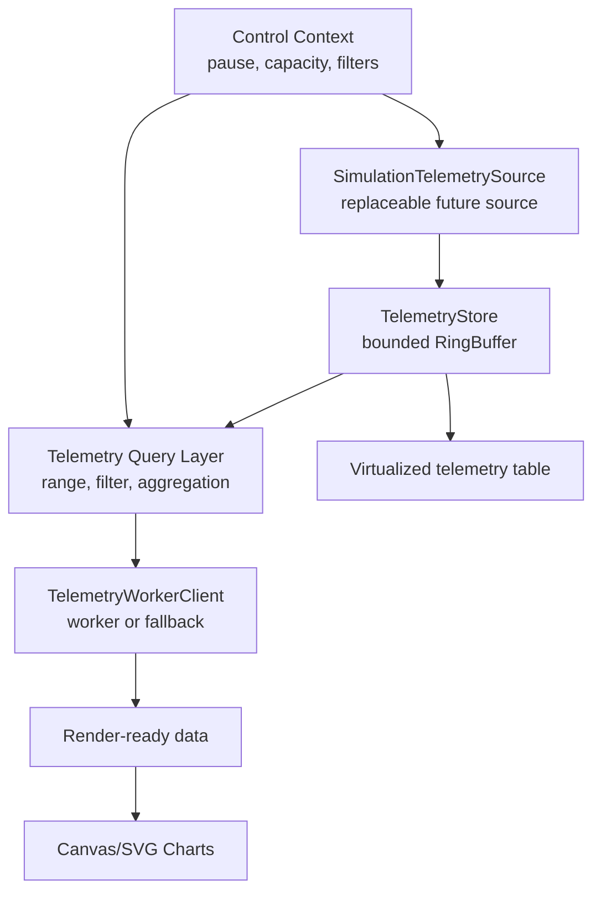

# Observa

High-performance real-time telemetry dashboard built with Next.js App Router, TypeScript, custom Canvas rendering, SVG overlays, custom table virtualization, bounded in-memory storage, and worker-backed processing.

[Live Demo](https://performance-dashboard-rose.vercel.app/dashboard)  
[GitHub Repository](https://github.com/ayushxt25/Performance-Dashboard)

`Next.js 16` `React 19` `TypeScript` `Canvas` `SVG overlays` `Web Worker` `Vitest`

The original v1.0.0 recruitment build is preserved; the current architecture prepares the same simulated dashboard for a future replaceable telemetry backend.

## Project Preview


Dashboard overview captured from the deployed application. It shows the live telemetry header, KPI cards, stream controls, performance monitor, Canvas charts, heatmap, and virtualized table.


Stress-test mode using the real UI and live measured values. The screenshot is not edited and does not fabricate performance numbers.


Mobile viewport showing the responsive control panel and chart layout.


Raw telemetry table with custom virtual scrolling and rendered-row count.

## Overview

PulseGrid is a dark observability-style dashboard for monitoring simulated distributed application services. It generates telemetry for service latency, throughput, CPU usage, memory usage, error rate, payload size, region, and status.

The project is intentionally performance-focused. It retains large datasets in bounded memory, ingests new telemetry every 100ms, avoids external chart libraries, and renders dense chart marks manually with Canvas. Lightweight SVG and HTML layers handle axes, labels, descriptions, controls, and interaction affordances where DOM-based rendering is more appropriate.

PulseGrid was built as a recruitment assignment to demonstrate practical frontend architecture: Server Components for initial data, Client Components for interaction, careful React state boundaries, custom chart rendering, Web Worker processing, and production-build validation.

## Key Features

- Real-time simulated telemetry updates every 100ms.
- Typed telemetry model with services, regions, statuses, latency, throughput, CPU, memory, error rate, and payload size.
- Capacity presets for 10,000, 50,000, and 100,000 retained points.
- Fixed-capacity circular buffer to prevent unbounded memory growth.
- Pause, resume, reset, batch-size controls, and stress-test mode.
- Service filtering and time-range selection.
- Raw, 1-minute, 5-minute, and 1-hour aggregation modes.
- Canvas line chart for latency over time with zoom, pan, reset view, hover tooltip, and viewport-aware downsampling.
- Canvas bar chart for throughput by service.
- Canvas scatter plot for payload size versus latency.
- Service latency heatmap.
- SVG overlays for semantic chart structure, axis lines, tick labels, and the latency crosshair.
- Custom virtualized telemetry table without an external virtualization library.
- Visible performance monitor for FPS, frame duration, chart render duration, data-processing duration, interaction latency, retained/generated points, long tasks, and heap support detection.
- Web Worker aggregation path with stale-response protection and main-thread fallback.
- Responsive desktop, tablet, and mobile layout.
- App Router loading and error boundaries.
- Bundle-size analysis script for aggregate browser JavaScript assets.
- Focused Vitest coverage for the ring buffer, aggregation, downsampling, virtualization range calculation, and time-range filtering.

## Performance Highlights

- **Bounded retention:** telemetry is stored in a fixed-capacity ring buffer rather than an ever-growing array.
- **Decoupled ingestion and rendering:** new telemetry is generated every 100ms, while React receives batched lightweight updates instead of replacing the full retained dataset every tick.
- **Canvas for dense marks:** line, bar, and scatter chart marks are drawn to Canvas to avoid thousands of DOM nodes.
- **SVG and HTML overlays:** SVG provides semantic chart titles/descriptions, axes, tick labels, and crosshair elements; HTML handles controls, legends, and tooltips.
- **Viewport-aware downsampling:** the latency line reduces rendered points when source data substantially exceeds available horizontal pixels.
- **Worker-backed processing:** aggregation and heatmap calculation can run in a Web Worker, with request IDs used to ignore stale responses.
- **Custom virtualization:** the raw telemetry table renders only visible rows plus overscan and displays rendered rows versus total rows.
- **Measured bundle asset size:** `npm run analyze:size` reported `675,006` raw bytes and `202,121` gzip bytes across aggregate `.next/static/chunks` JavaScript assets for the completed production build.

The bundle-size result is an aggregate build-asset measurement. It may include shared chunks that are not all loaded on the dashboard route. Runtime performance varies by device, browser, build, and active controls. See [PERFORMANCE.md](PERFORMANCE.md) for methodology, caveats, and scaling notes.

## Architecture



### Data Flow

1. `app/dashboard/page.tsx` generates the initial dataset as a Server Component.
2. `DashboardClient` passes that data into `DataProvider`.
3. `SimulationTelemetrySource` emits batches through the same source interface a future remote source can implement.
4. `TelemetryStore` owns bounded retention and exposes immutable lightweight snapshots plus query/read methods.
5. Query and worker layers derive filtered, aggregated, and render-ready data when controls change.
6. Chart components render dense marks on Canvas and use SVG/HTML for lightweight overlays.
7. The telemetry table computes a visible range from `scrollTop` and renders only rows in that range plus overscan.

## Tech Stack

- Next.js App Router
- React
- TypeScript
- Canvas 2D API
- SVG overlays
- Web Workers
- ResizeObserver
- PerformanceObserver
- Vitest
- ESLint

No charting library, component library, external state-management library, database, authentication layer, WebSocket server, or middleware is used.

## Next.js Implementation

- `/dashboard` is implemented with the App Router.
- `app/dashboard/page.tsx` remains a Server Component for initial telemetry generation.
- Interactive dashboard functionality is isolated in Client Components.
- `/api/data` is an App Router Route Handler for generated telemetry batches.
- `loading.tsx` and `error.tsx` provide route-level loading and error states.
- The production build statically generates `/dashboard` and serves `/api/data` dynamically.

## Project Structure

```text
app/
  api/data/route.ts          Generated telemetry Route Handler
  dashboard/                 App Router dashboard route
components/
  charts/                    Manual Canvas charts and SVG overlays
  controls/                  Stream controls and time-range selector
  dashboard/                 Dashboard shell, header, KPI cards
  providers/                 Ref-backed DataProvider
  ui/                        Performance monitor and virtualized table
hooks/
  useDataStream.ts           Typed data Context hook
lib/
  telemetry/                  Domain types, source, store, query layer
  workers/                    Typed worker client abstraction
  performance/                Shared marks and metrics helpers
  rendering/                  Canvas, scale, viewport helpers
  visualization/              Chart input contracts
  aggregation.ts             Filtering, aggregation, heatmap helpers
  canvasUtils.ts             Canvas setup and downsampling helpers
  dataGenerator.ts           Deterministic telemetry generator
  performanceUtils.ts        Virtualization range calculation
  ringBuffer.ts              Fixed-capacity circular buffer
  types.ts                   Shared TypeScript types
workers/
  data.worker.ts             Worker aggregation path
tests/
  *.test.ts                  Focused Vitest tests for pure behavior
scripts/
  analyze-size.mjs           Aggregate JavaScript asset-size analyzer
public/screenshots/
  *.png                      README screenshots captured from deployment
```

## Getting Started

```bash
npm install
npm run dev
```

Open `http://localhost:3000/dashboard`.

## Available Scripts

```bash
npm run dev
npm run lint
npm run typecheck
npm run test
npm run build
npm run start
npm run analyze:size
```

`analyze:size` expects a completed production build and reads JavaScript assets from `.next/static/chunks`.

## Validation

The project is validated with:

```bash
npm run lint
npm run typecheck
npm run test
npm run build
```

The test suite covers:

- Circular-buffer overwrite behavior.
- Aggregation correctness and aggregation shape changes.
- Time-range filtering.
- Viewport-aware downsampling.
- Virtualized table range calculation.

## Deployment

The live deployment is available at:

https://performance-dashboard-rose.vercel.app/dashboard

The app can be deployed as a standard Next.js application on Vercel or any host that supports the Next.js App Router production build.

## Browser Notes

PulseGrid uses Canvas, SVG, ResizeObserver, Web Workers, requestAnimationFrame, and PerformanceObserver. Heap usage is shown only when the browser exposes `performance.memory`; otherwise the dashboard reports `Not supported`.

## Limitations

- The telemetry is simulated and deterministic; it is not connected to a production service or database.
- Worker requests currently receive snapshots rather than shared typed-array buffers.
- Benchmark values other than the aggregate JavaScript asset-size measurement are intentionally left as measurement placeholders in `PERFORMANCE.md`.
- Browser support for heap and long-task reporting varies.

## Documentation

- [PERFORMANCE.md](PERFORMANCE.md) explains rendering decisions, bounded memory, worker usage, virtualization, measurement methodology, and scaling considerations.
